# Benchmark

## Test Driver

The system driving the benchmark is a desktop computer connected to a wired network.

| Parameter             | Value                        |
| --------------------- | ---------------------------- |
| OS                    | Windows 10 Pro               |
| Processor             | Intel Core i5 750 @ 2.67 GHz |
| System type           | x64                          |
| Installed memory (GB) | 8                            |
| Download speed (Mbps) | 84                           |
| Upload speed (Mbps)   | 92                           |

## System Under Test

All benchmarks are targeting a web server running in a Docker container on a EC2 instace in Amazon Web Services (AWS).

| Parameter              | Value               |
| ---------------------- | ------------------- |
| AWS region             | eu-west-1 (Ireland) |
| EC2 instance type      | m3.medium           |
| CPU units              | 512                 |
| Hard memory limit (MB) | 512                 |

## Duration And Threads

Benchmarks have been configured to run for 300 seconds. A benchmark starts with one thread generating load and then continuously creates a new thread every second, until the duration of the benchmark is reached and 300 threads concurrently generates load on the web server. This linear load ramp up will hopefully show the performant range of the web server, and at what point it starts to struggle.

## Results

### Health

#### Summary

| Technology | Error     | Average Response Time (ms) | 90th Percentile (ms) | 95th Percentile (ms) | 99th Percentile (ms) | Throughput  |
| ---------- | --------- | -------------------------- | -------------------- | -------------------- | -------------------- | ----------- |
| .NET Core  | __0.00%__ | 46.74                      | 85                   | 93                   | 116                  | 3209.03     |
| Clojure    | __0.00%__ | 67.22                      | 143                  | 157                  | 183                  | 2235.35     |
| Go         | __0.00%__ | __36.35__                  | __53__               | __63__               | __85__               | __4111.93__ |
| NodeJS     | __0.00%__ | 67.38                      | 157                  | 222                  | 281                  | 2230.20     |

#### Response Time Over Threads

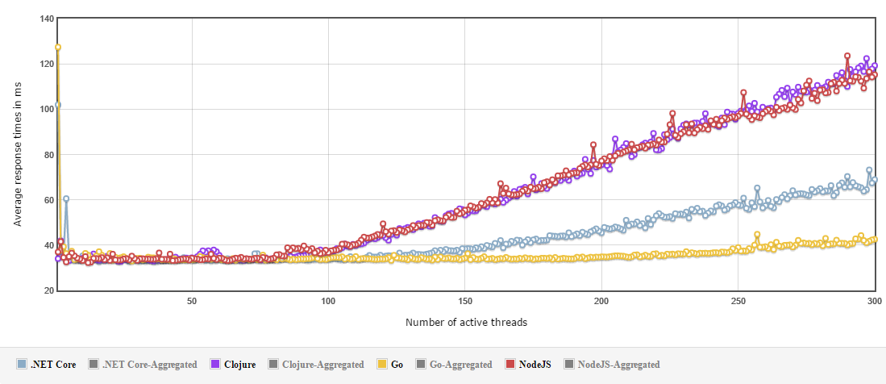

#### Response Times Over Time

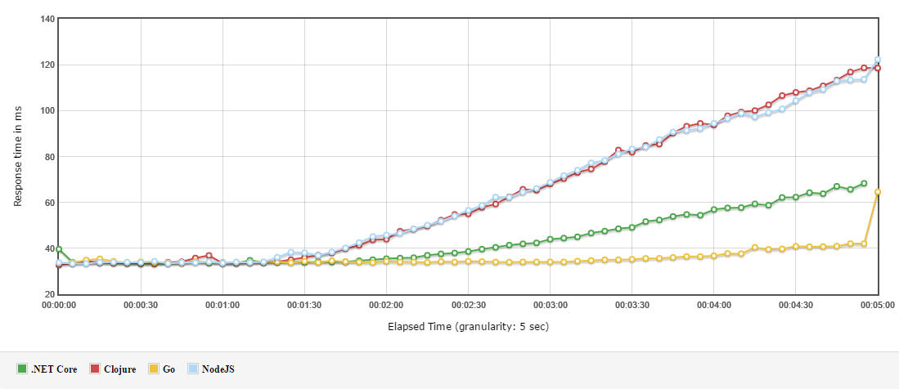

#### Transactions Per Second

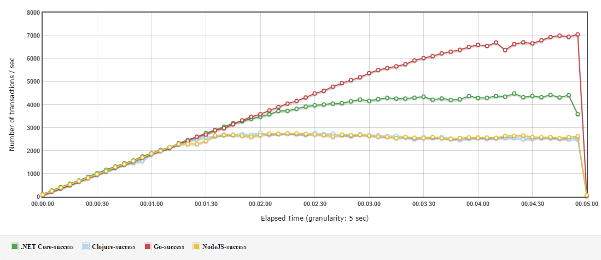

### Echo

#### Summary

| Technology | Error     | Average Response Time (ms) | 90th Percentile (ms) | 95th Percentile (ms) | 99th Percentile (ms) | Throughput  |
| ---------- | --------- | -------------------------- | -------------------- | -------------------- | -------------------- | ----------- |
| .NET Core  | __0.00%__ | 62.90                      | 131                  | 145                  | 192                  | 2357.16     |
| Clojure    | __0.00%__ | 74.51                      | 156                  | 170                  | 200                  | 2014.35     |
| Go         | __0.00%__ | __38.23__                  | __57__               | __67__               | __86__               | __3920.98__ |
| NodeJS     | __0.00%__ | 82.07                      | 224                  | 300                  | 372                  | 1823.86     |

#### Response Time Over Threads

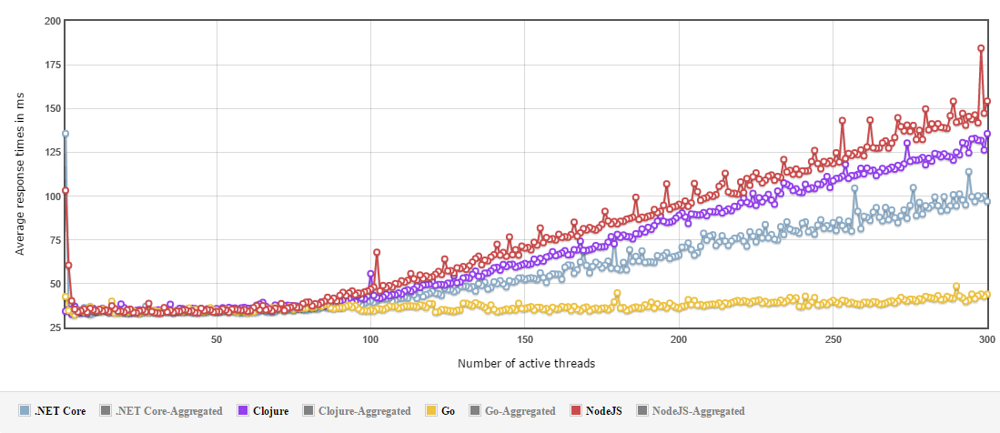

#### Response Times Over Time

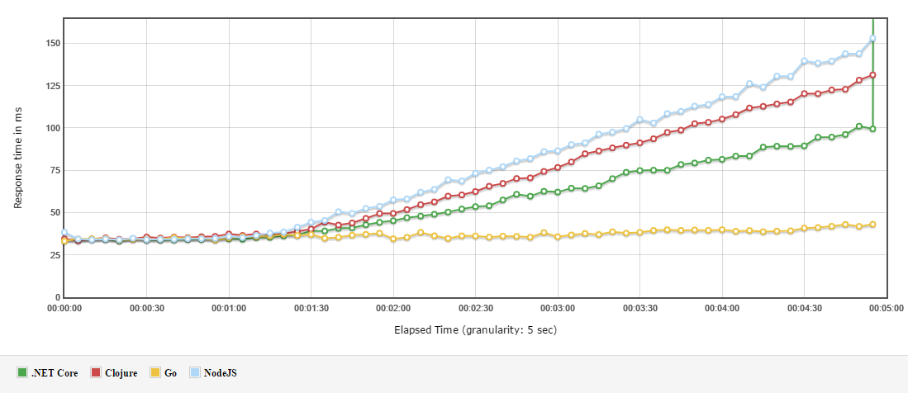

#### Transactions Per Second

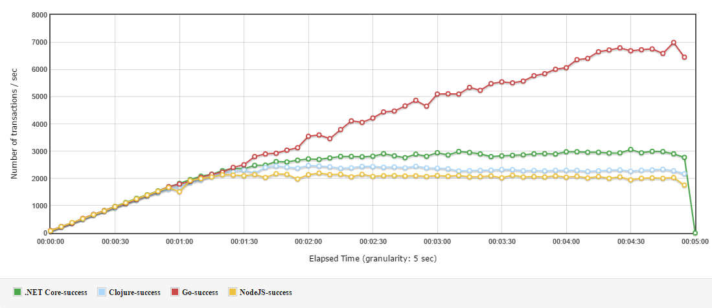

### Relay

#### Summary

| Technology | Error     | Average Response Time (ms) | 90th Percentile (ms) | 95th Percentile (ms) | 99th Percentile (ms) | Throughput  |
| ---------- | --------- | -------------------------- | -------------------- | -------------------- | -------------------- | ----------- |
| .NET Core  | __0.00%__ | 159.47                     | 330                  | 355                  | 423                  | 942.84      |
| Clojure    | __0.00%__ | 140.40                     | 290                  | 304                  | 334                  | 1068.82     |
| Go         | __0.00%__ | __123.99__                 | __285__              | __300__              | __332__              | __1212.80__ |
| NodeJS     | __0.00%__ | 300.93                     | 721                  | 749                  | 790                  | 499.91      |

#### Response Time Over Threads

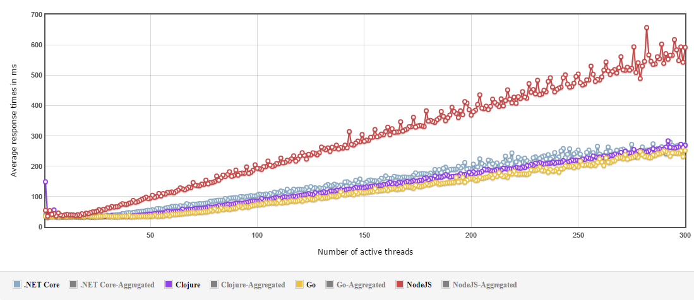

#### Response Times Over Time

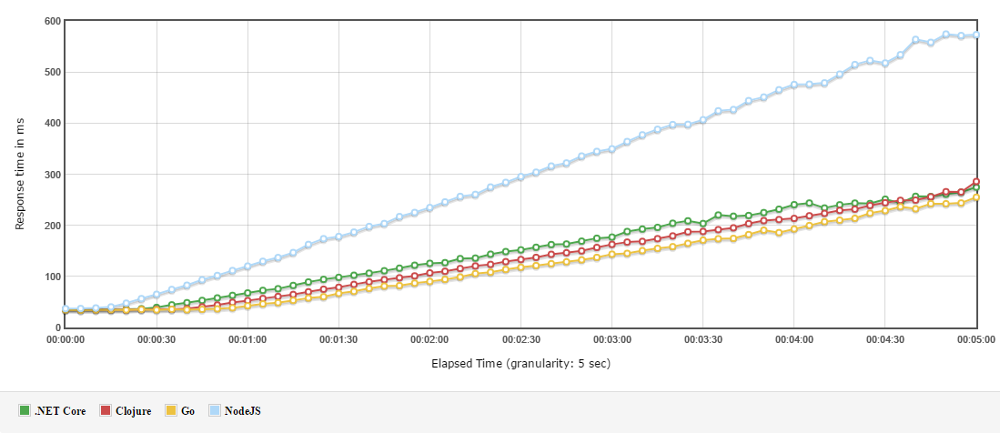

#### Transactions Per Second

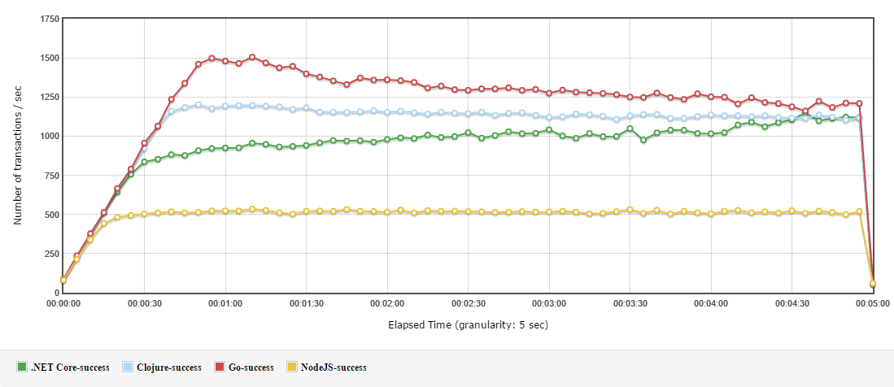

### Contacts

The benchmark has been run against Amazon Relational Database Service (RDS) pre-populated with 1,000,000 contacts.

| Parameter             | Value                           |
| --------------------- | ------------------------------- |
| DB Engine Version     | PostgreSQL 9.5.4-R1             |
| DB Instance Class     | db.t2.medium (2 vCPU, 4 GB RAM) |

#### Summary

| Technology | Error     | Average Response Time (ms) | 90th Percentile (ms) | 95th Percentile (ms) | 99th Percentile (ms) | Throughput  |
| ---------- | --------- | -------------------------- | -------------------- | -------------------- | -------------------- | ----------- |
| .NET Core  | __0.00%__ | __143.60__                 | __335__              | __384__              | __472__              | __1046.96__ |
| Clojure    | __0.00%__ | 151.79                     | 447                  | 479                  | 537                  | 990.87      |
| Go         | __0.00%__ | 329.88                     | 1027                 | 1129                 | 1336                 | 456.21      |
| NodeJS     | __0.00%__ | 201.84                     | 485                  | 513                  | 601                  | 745.15      |

#### Response Time Over Threads

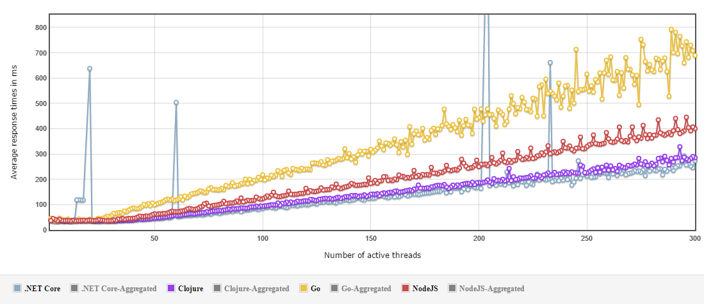

#### Response Times Over Time

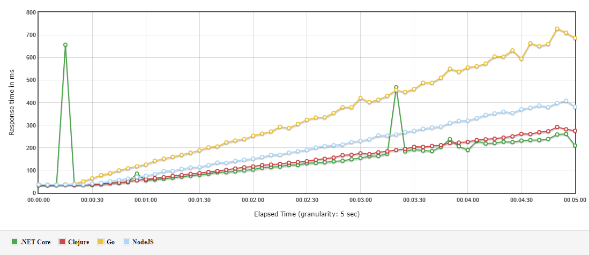

#### Transactions Per Second

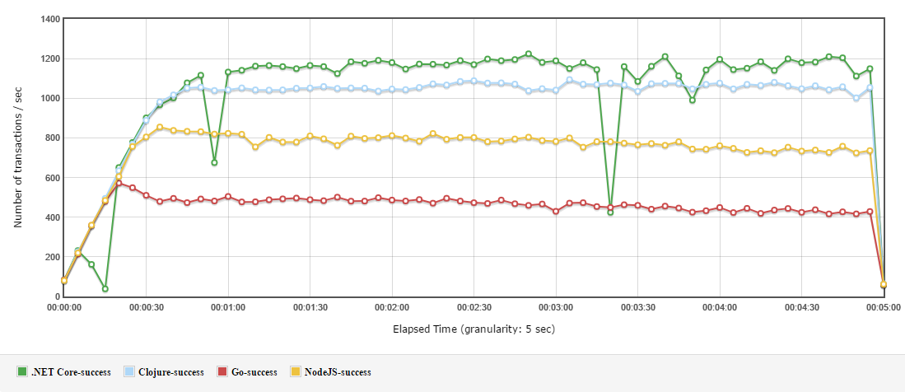
